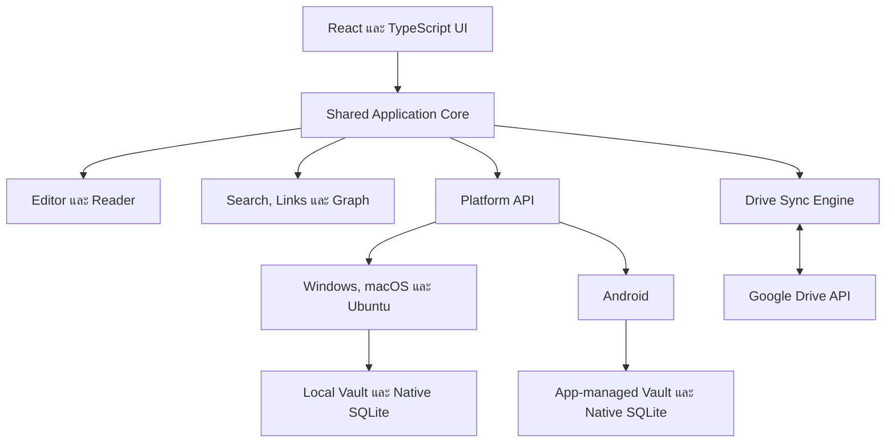

# myVault — Project Plan and Session Handoff

> เอกสารหลักสำหรับกำหนดทิศทาง วางแผน ติดตามสถานะ และส่งต่องานข้าม session ค่ะ

## 1. Project Summary

`myVault` เป็นแอปจัดการ Markdown Vault แบบ local-first ที่มีประสบการณ์ใกล้เคียง Obsidian และ Sync กับ Vault บน Google Drive ได้โดยตรงค่ะ

รุ่นแรกเป็น Native cross-platform application สำหรับผู้ใช้คนเดียว รองรับ Windows, macOS, Ubuntu และ Android โดยไม่มี backend, hosting, VPN, App Store หรือ Play Store ค่ะ

เป้าหมายสูงสุดของรุ่นแรกคือข้อมูลต้องไม่สูญหาย ทำงาน offline ได้ และจัดการ conflict อย่างโปร่งใสค่ะ

## 2. Locked Decisions

- ใช้ Tauri 2 เป็น application shell ค่ะ
- ใช้ React และ TypeScript สำหรับ UI ร่วมกันทุก platform ค่ะ
- ใช้ Rust สำหรับ filesystem, SQLite, secure storage, file watcher และ platform integration ค่ะ
- ใช้ Google Drive REST API เป็นระบบ Sync กลางค่ะ
- เชื่อม Google Drive โดยตรงจากแต่ละอุปกรณ์ค่ะ
- ไม่มี application backend ในรุ่นแรกค่ะ
- ไม่มี hosting, domain หรือ VPN ในรุ่นแรกค่ะ
- ใช้งานส่วนตัวเพียงคนเดียวในรุ่นแรกค่ะ
- ไม่เผยแพร่ผ่าน App Store, Play Store หรือ Microsoft Store ในรุ่นแรกค่ะ
- แจก build ผ่าน GitHub Releases หรือติดตั้งด้วยไฟล์ที่ build เองค่ะ
- ใช้ Existing Vault บน Google Drive ได้ค่ะ
- ไฟล์ Markdown และ attachment ยังคงเป็นไฟล์ปกติและไม่ผูกขาดกับแอปค่ะ
- Obsidian บน desktop สามารถเปิด local Vault เดียวกันกับ myVault ได้ค่ะ
- SQLite เป็นเพียง index และ operational state ที่สร้างใหม่ได้ ไม่ใช่ source of truth ค่ะ
- การลบไฟล์ใช้ Vault-local `.trash/` เพื่อให้ย้ายและกู้คืนได้สม่ำเสมอข้าม platform ค่ะ
- `.trash/` ต้องถูกซ่อนจาก file explorer ปกติ และไม่ถูกรวมใน index, search, backlinks หรือ graph ค่ะ
- ห้ามใช้ silent last-write-wins เมื่อเกิด Sync conflict ค่ะ
- เลื่อน Canvas, plugin system, collaboration, public sharing และ E2EE ออกจากรุ่นแรกค่ะ

## 3. Zero-cost Constraint

เป้าหมายค่าใช้จ่ายเงินสดของรุ่นแรกคือ 0 บาทค่ะ

- Windows ใช้ unsigned installer หรือ portable build และยอมรับ SmartScreen warning บนเครื่องส่วนตัวค่ะ
- macOS ใช้ local build หรือ unsigned/ad-hoc signed build และอนุญาตผ่าน Gatekeeper ด้วยตัวเองค่ะ
- Ubuntu ใช้ AppImage หรือ `.deb` ที่สร้างเองค่ะ
- Android ใช้ signed APK และ sideload ด้วยตัวเองค่ะ
- ใช้ GitHub repository และ GitHub Releases ภายในโควตาฟรีค่ะ
- ใช้ GitHub Actions ภายในโควตาฟรี หรือใช้ self-hosted/local runners ค่ะ
- ใช้ Google Drive API ภายใน personal usage quota ค่ะ
- ใช้พื้นที่ Google Drive ที่มีอยู่แล้วค่ะ

ค่าใช้จ่ายที่อาจพิจารณาภายหลัง ได้แก่ Google Play Developer account, Apple Developer Program, Windows code signing และ infrastructure สำหรับ public distribution ค่ะ

## 4. Product Scope

### 4.1 MVP Features

- Google OAuth และเลือก Existing Drive Vault folder ค่ะ
- เลือกหรือสร้าง local Vault ค่ะ
- File explorer และ folder tree ค่ะ
- สร้าง แก้ไข rename move trash และ restore note ค่ะ
- Edit Mode และ Reader Mode ค่ะ
- Markdown headings, lists, task lists และ tables ค่ะ
- Syntax-highlighted code blocks ค่ะ
- Mermaid diagrams ค่ะ
- Images และ attachments ค่ะ
- YAML frontmatter และ properties ค่ะ
- `[[Wiki Links]]` และ `![[Embeds]]` ค่ะ
- Backlinks และ unlinked mentions รุ่นพื้นฐานค่ะ
- Full-text search และ quick switcher ค่ะ
- Local Graph และ Global Graph รุ่นพื้นฐานค่ะ
- Offline editing และ durable sync queue ค่ะ
- Three-way merge และ conflict copies ค่ะ
- Local recovery snapshots ค่ะ
- Sync status, history, retry และ diagnostics ค่ะ
- Dark mode และ responsive desktop/Android layout ค่ะ

### 4.2 Deferred Features

- Obsidian plugin API compatibility ค่ะ
- Arbitrary JavaScript plugins ค่ะ
- Canvas แบบเต็มรูปแบบค่ะ
- Real-time multi-user collaboration ค่ะ
- End-to-end encryption ค่ะ
- Public publishing ค่ะ
- Dataview-compatible query engine แบบเต็มรูปแบบค่ะ
- Store distribution และ polished code signing ค่ะ

## 5. Architecture



### 5.1 Recommended Repository Structure

```text
myVault/
├── apps/
│   └── tauri/
│       ├── frontend/
│       └── src-tauri/
├── packages/
│   ├── core/
│   ├── editor/
│   ├── markdown/
│   ├── search/
│   ├── graph/
│   ├── sync/
│   ├── platform-api/
│   └── ui/
├── crates/
│   ├── vault-fs/
│   ├── vault-db/
│   ├── drive-client/
│   ├── secure-storage/
│   └── sync-engine/
├── tests/
│   ├── fixtures/
│   ├── sync-scenarios/
│   └── cross-platform/
└── PROJECT_PLAN.md
```

โครงสร้างจริงอาจปรับหลัง Technical Spike แต่ต้องรักษาหลักการแบ่ง shared logic ออกจาก platform-specific mechanics ค่ะ

## 6. Vault and Storage Model

### 6.1 Source of Truth

- Markdown และ attachment ใน Vault เป็นข้อมูลจริงค่ะ
- Google Drive เป็น remote copy และจุดแลกเปลี่ยนข้อมูลระหว่างอุปกรณ์ค่ะ
- Local Vault เป็น working copy ของแต่ละอุปกรณ์ค่ะ
- SQLite เก็บข้อมูลที่คำนวณใหม่หรือกู้คืนจาก Vault และ Drive ได้ค่ะ

### 6.2 Desktop Behavior

- myVault เปิด local folder จริงค่ะ
- Obsidian สามารถเปิด local folder เดียวกันได้ค่ะ
- file watcher ตรวจจับการเปลี่ยนแปลงจาก Obsidian หรือโปรแกรมอื่นค่ะ
- ห้ามใช้ Google Drive Desktop Sync กับ working folder เดียวกันพร้อมกับ myVault Sync Engine ค่ะ

### 6.3 Android Behavior

- รุ่นแรกเก็บ Vault ใน app-managed storage ค่ะ
- myVault เป็น editor หลักของ local Android Vault ค่ะ
- Android Sync กับ Drive ผ่าน Drive API โดยตรงค่ะ
- การเปิด arbitrary external folder บน Android เป็นงานที่ต้องพิสูจน์ใน Technical Spike ค่ะ

### 6.4 Obsidian Compatibility Rules

- รักษา Markdown ที่ไม่รู้จักไว้โดยไม่ rewrite ทั้งไฟล์โดยไม่จำเป็นค่ะ
- รักษา YAML frontmatter และ unknown fields ค่ะ
- รองรับ wiki links, embeds, tags, callouts และ relative attachment paths ค่ะ
- ไม่แก้หรือลบไฟล์ใน `.obsidian` โดยอัตโนมัติค่ะ
- ไม่พยายามโหลด Obsidian community plugins ในรุ่นแรกค่ะ

## 7. Sync Mechanics

### 7.1 Local-first Write Path

1. เขียนไฟล์ลง local storage แบบ atomic write ค่ะ
2. บันทึก local revision และ content hash ค่ะ
3. เพิ่มงานลง durable sync queue ค่ะ
4. ตรวจ remote metadata และ revision ก่อน upload ค่ะ
5. upload เมื่อยืนยันว่าไม่มี remote conflict ค่ะ
6. ตรวจ remote revision หลัง upload ค่ะ
7. ลบงานออกจาก queue เมื่อ verify สำเร็จเท่านั้นค่ะ

### 7.2 Pull Path

1. เรียก Drive Changes API จาก page token ล่าสุดค่ะ
2. ดึง metadata เฉพาะไฟล์ที่เปลี่ยนค่ะ
3. เปรียบเทียบ remote state กับ base และ local state ค่ะ
4. ดาวน์โหลดเฉพาะเมื่อ local ไม่ dirty ค่ะ
5. ทำ three-way merge หรือสร้าง conflict copy เมื่อทั้งสองฝั่งเปลี่ยนค่ะ
6. re-index เฉพาะไฟล์ที่ได้รับผลกระทบค่ะ

### 7.3 Sync State

```text
Clean
LocalDirty
RemoteChanged
Uploading
Downloading
Conflict
Merging
NeedsReview
RetryScheduled
AuthRequired
```

### 7.4 Conflict Rules

- ถ้าเปลี่ยนเฉพาะ local ให้อัปโหลดค่ะ
- ถ้าเปลี่ยนเฉพาะ remote ให้ดาวน์โหลดค่ะ
- ถ้าทั้ง local และ remote เปลี่ยน ให้ใช้ three-way merge ค่ะ
- ถ้า merge ไม่ปลอดภัย ให้รักษาทั้งสองฉบับค่ะ
- ถ้าฝั่งหนึ่งลบแต่อีกฝั่งแก้ ให้รักษาฉบับที่ถูกแก้ค่ะ
- delete ต้องย้ายเข้า Trash ก่อนค่ะ
- ห้ามลบ conflict copy อัตโนมัติค่ะ
- ต้องมีประวัติว่า conflict เกิดจาก device ใดและเวลาใดค่ะ

ตัวอย่างชื่อไฟล์ conflict ค่ะ

```text
Project (conflict from Android 2026-07-11 18-30).md
```

## 8. Security Rules

- เปิด Google OAuth ผ่าน system browser ค่ะ
- ใช้ PKCE และ native-app authorization flow ตาม platform ค่ะ
- เก็บ refresh token ใน OS secure storage ค่ะ
- ห้ามเก็บ refresh token ใน repository, log หรือ plaintext settings ค่ะ
- ห้าม commit Android signing keystore หรือรหัสผ่านค่ะ
- sanitize rendered HTML ก่อนแสดงใน Reader Mode ค่ะ
- ใช้ CSP และปิด `eval` ค่ะ
- ใช้ Mermaid security mode แบบ strict หรือ sandbox ค่ะ
- จำกัดสิทธิ์ Tauri commands และ filesystem scopes ตาม least privilege ค่ะ
- ตรวจ MIME type, file size และ path traversal สำหรับ attachments ค่ะ
- log ต้องไม่บันทึก note content หรือ token โดยปริยายค่ะ

## 9. Team Operating Model

### 9.1 Leadership

Sunday เป็นหัวหน้าทีมและเป็นผู้รับผิดชอบผลลัพธ์สุดท้ายของโครงการค่ะ

Sunday มีหน้าที่ดังนี้ค่ะ

- กำหนด architecture, domain boundaries, data flow และ public contracts ค่ะ
- กำหนด logic ของระบบและ mechanics ที่ sub-agents ต้องปฏิบัติตามค่ะ
- แยกงานเป็น bounded tasks ที่มี input, output และ acceptance criteria ชัดเจนค่ะ
- เลือกงานที่สามารถทำขนานกันได้โดยลดโอกาสแก้ไฟล์ชนกันค่ะ
- spawn sub-agents เพื่อทำงานย่อยที่เป็นอิสระเมื่อคุ้มค่ากับเวลาและ context ค่ะ
- ระบุไฟล์ที่แต่ละ sub-agent มีสิทธิ์แก้และไฟล์ที่ห้ามแตะค่ะ
- ตรวจ assumption, design choice, patch และ test result ของ sub-agents ค่ะ
- ตัดสินใจเมื่อผลจากหลาย sub-agents ขัดแย้งกันค่ะ
- แก้ไขสถานการณ์เมื่อเกิด blocker, regression หรือ scope drift ค่ะ
- รวมผลงานและรักษาความสอดคล้องของระบบทั้งหมดค่ะ
- เป็นผู้อนุมัติขั้นสุดท้ายก่อนถือว่างานย่อยเสร็จค่ะ
- อัปเดตเอกสาร handoff และสถานะโครงการเมื่อจบแต่ละช่วงงานค่ะ

### 9.2 Sub-agent Task Brief

ทุกงานที่มอบหมายให้ sub-agent ต้องระบุข้อมูลต่อไปนี้ค่ะ

- เป้าหมายที่วัดผลได้ค่ะ
- ขอบเขตไฟล์และ module ที่รับผิดชอบค่ะ
- interface หรือ contract ที่ต้องรักษาค่ะ
- สิ่งที่ห้ามเปลี่ยนค่ะ
- dependency และ assumption ค่ะ
- acceptance criteria ค่ะ
- test commands ที่ต้องรันค่ะ
- รูปแบบรายงานผลกลับค่ะ

### 9.3 Parallel Work Rules

- งานขนานต้องแยกตาม module หรือ file ownership ให้ชัดเจนค่ะ
- ห้ามให้ sub-agents หลายตัวแก้ไฟล์เดียวกันพร้อมกันโดยไม่มี coordination ค่ะ
- Architecture decision และ cross-module contract ต้องผ่าน Sunday ค่ะ
- Sub-agent สามารถเสนอทางเลือกได้ แต่ห้ามเปลี่ยน architecture เองนอกขอบเขตที่ได้รับค่ะ
- งานที่เสี่ยงต่อข้อมูลสูญหายต้องมี design review ก่อน implementation ค่ะ
- งาน Sync, migration, deletion และ security ต้องได้รับ review เพิ่มเป็นพิเศษค่ะ
- Sunday ต้องตรวจ diff และผลทดสอบก่อน integration ทุกครั้งค่ะ

### 9.4 Incident Handling

เมื่อเกิด test failure, regression หรือ implementation ไม่ตรง contract ให้ดำเนินการดังนี้ค่ะ

1. หยุดการรวม patch ที่เกี่ยวข้องค่ะ
2. บันทึกอาการ วิธี reproduce และผลกระทบค่ะ
3. แยกว่าปัญหาอยู่ที่ requirement, contract หรือ implementation ค่ะ
4. Sunday กำหนด corrective action และเจ้าของงานค่ะ
5. เพิ่ม regression test ก่อนหรือพร้อมการแก้ไขค่ะ
6. ตรวจผลซ้ำบน platform ที่ได้รับผลกระทบค่ะ
7. อัปเดต handoff และ risk register ค่ะ

### 9.5 Definition of Done

งานจะถือว่าเสร็จเมื่อมีเงื่อนไขครบดังนี้ค่ะ

- ตรงตาม acceptance criteria ค่ะ
- ไม่มีการเปลี่ยน scope โดยไม่ได้รับอนุมัติค่ะ
- มี test ตามระดับความเสี่ยงค่ะ
- test ที่เกี่ยวข้องผ่านค่ะ
- error path และ recovery path ได้รับการพิจารณาค่ะ
- Sunday ตรวจ diff และ integration impact แล้วค่ะ
- เอกสารหรือ handoff ได้รับการอัปเดตเมื่อจำเป็นค่ะ

## 10. Delivery Roadmap

### Phase 0 — Technical Spike

ระยะเวลาเป้าหมาย 1–2 สัปดาห์ค่ะ

- bootstrap Tauri 2, React, TypeScript และ Rust workspace ค่ะ
- เปิด application shell บน macOS, Windows, Ubuntu และ Android ค่ะ
- ทดลอง local filesystem และ native SQLite ค่ะ
- ทดลอง Android app-managed storage ค่ะ
- ทดลอง Google OAuth ผ่าน system browser ค่ะ
- ทดลองเลือก Existing Drive folder ค่ะ
- upload, download และตรวจ changes ของ Markdown หนึ่งไฟล์ค่ะ
- ทดลอง secure token storage ค่ะ
- ทดลอง CodeMirror, Mermaid และ Sigma.js บน Android WebView ค่ะ
- ทดสอบภาษาไทย, IME, selection และ virtual keyboard ค่ะ

จุดตัดสินใจคือ Tauri Android และ library stack ต้องผ่านก่อนลงทุนสร้าง UI เต็มระบบค่ะ

### Phase 1 — Local Vault Core

ระยะเวลาเป้าหมาย 2 สัปดาห์ค่ะ

- local Vault selection และ creation ค่ะ
- file explorer และ file operations ค่ะ
- desktop file watcher ค่ะ
- atomic writes และ crash recovery ค่ะ
- SQLite metadata schema และ migrations ค่ะ
- local recovery snapshots ค่ะ
- `.obsidian` preservation policy ค่ะ

ลำดับ implementation ที่อนุมัติแล้วมีดังนี้ค่ะ

1. ล็อก portable Vault path contract, safety policy และ error contract ข้าม Windows, macOS, Ubuntu และ Android ค่ะ
2. เพิ่ม Vault inventory, bounded scan, create และ list operations ค่ะ
3. เพิ่ม rename, move, Vault-local `.trash/` และ restore โดยห้าม overwrite ปลายทางโดยเงียบค่ะ
4. เพิ่ม private recovery snapshots, stale-revision protection และ crash recovery ค่ะ
5. อัปเกรด SQLite derived-index schema และทดสอบ rebuild จาก Vault ค่ะ
6. เพิ่ม desktop native watcher และการ normalize/suppress event ค่ะ
7. เชื่อม custom least-privilege Tauri commands, desktop folder picker และ Android app-managed Vault ค่ะ
8. สร้าง file explorer ขั้นต่ำและรัน cross-platform acceptance suite ค่ะ

ค่าเริ่มต้นของ Phase 1 คือ portable UTF-8 paths, no silent overwrite, recovery snapshots เก็บ 30 วันหรือสูงสุด 100 revisions ต่อ note และรวมไม่เกิน 1 GiB ต่อ Vault ค่ะ `.obsidian/` และ `.trash/` เป็น protected/internal directories ที่ไม่รวมใน index ปกติค่ะ

### Phase 2 — Editor and Reader

ระยะเวลาเป้าหมาย 2–3 สัปดาห์ค่ะ

- CodeMirror 6 editor ค่ะ
- Reader Mode และ sanitized rendering ค่ะ
- GFM tables และ task lists ค่ะ
- code highlighting และ Mermaid ค่ะ
- images และ attachments ค่ะ
- frontmatter, wiki links และ embeds ค่ะ
- responsive desktop/Android layout ค่ะ

### Phase 3 — Drive Sync Engine

ระยะเวลาเป้าหมาย 3–4 สัปดาห์ค่ะ

- initial Drive scan ค่ะ
- upload และ download paths ค่ะ
- Changes API cursor ค่ะ
- durable queue และ retry policy ค่ะ
- rename, move, delete และ attachment handling ค่ะ
- three-way merge และ conflict copies ค่ะ
- token expiry และ re-authentication ค่ะ
- Sync UI, history และ diagnostics ค่ะ

### Phase 4 — Knowledge Features

ระยะเวลาเป้าหมาย 2–3 สัปดาห์ค่ะ

- wiki link autocomplete ค่ะ
- backlinks และ unlinked mentions ค่ะ
- tags และ properties ค่ะ
- full-text search และ quick switcher ค่ะ
- outline, Local Graph และ Global Graph ค่ะ
- incremental indexing ค่ะ

### Phase 5 — Cross-platform Hardening

ระยะเวลาเป้าหมาย 2–3 สัปดาห์ค่ะ

- Windows portable/installer build ค่ะ
- macOS app/DMG build ค่ะ
- Ubuntu AppImage build ค่ะ
- Android signed APK ค่ะ
- platform permissions และ lifecycle handling ค่ะ
- database upgrade testing ค่ะ
- import, export และ recovery testing ค่ะ

### Phase 6 — Personal Release

ระยะเวลาเป้าหมาย 1–2 สัปดาห์ค่ะ

- GitHub release workflow ค่ะ
- versioning และ changelog ค่ะ
- manual update process ค่ะ
- installation guides ค่ะ
- signing-key backup procedure ค่ะ
- known limitations และ recovery guide ค่ะ

ระยะรวมเป้าหมายสำหรับงานเต็มเวลาคือประมาณ 13–17 สัปดาห์ค่ะ

## 11. Required Test Scenarios

### 11.1 Data Safety

- ปิดแอประหว่าง atomic write ค่ะ
- ปิดเครื่องระหว่าง upload ค่ะ
- อินเทอร์เน็ตหลุดระหว่าง download ค่ะ
- token หมดอายุระหว่าง Sync ค่ะ
- Drive ตอบ `403`, `429` และ `5xx` ค่ะ
- SQLite เสียและ rebuild จาก Vault ค่ะ
- local disk หรือ Drive storage เต็มค่ะ

### 11.2 Conflict Matrix

- แก้บรรทัดเดียวกันจากสองอุปกรณ์ค่ะ
- แก้คนละส่วนของไฟล์ค่ะ
- rename พร้อม edit ค่ะ
- move พร้อม edit ค่ะ
- delete พร้อม edit ค่ะ
- สร้างชื่อไฟล์เดียวกันพร้อมกันค่ะ
- Android offline หลายวันแล้วกลับมา Sync ค่ะ
- Obsidian แก้ไฟล์ขณะ myVault เปิดอยู่ค่ะ

### 11.3 Compatibility and Scale

- ภาษาไทยและ Unicode ค่ะ
- path ที่มีช่องว่างและชื่อไฟล์ภาษาไทยค่ะ
- YAML frontmatter และ wiki links ค่ะ
- relative attachments ค่ะ
- Markdown ขนาดใหญ่ค่ะ
- image และ PDF attachments ค่ะ
- Vault ขนาด 1,000, 5,000 และ 10,000 notes ค่ะ

## 12. Risk Register

| Risk | Impact | Mitigation |
|---|---|---|
| Tauri Android plugin หรือ WebView มีข้อจำกัดค่ะ | สูงค่ะ | พิสูจน์ใน Phase 0 ก่อนสร้าง UI เต็มระบบค่ะ |
| Sync race ทำให้ข้อมูลสูญหายค่ะ | วิกฤตค่ะ | three-way merge, conflict copy, revision verification และ destructive-operation tests ค่ะ |
| Android background task ถูกจำกัดค่ะ | สูงค่ะ | Sync ตอน launch, foreground, manual action และใช้ background schedule เท่าที่ระบบอนุญาตค่ะ |
| Existing Vault มี syntax ที่ parser ไม่รู้จักค่ะ | สูงค่ะ | preserve raw content และหลีกเลี่ยง full-document rewrite ค่ะ |
| OAuth token ถูกเปิดเผยค่ะ | วิกฤตค่ะ | PKCE, OS secure storage, redacted logs และ secret scanning ค่ะ |
| Multi-platform build แตกต่างกันค่ะ | กลางค่ะ | platform matrix CI และทดสอบ spike ตั้งแต่ต้นค่ะ |
| `.obsidian` ถูกแก้โดยไม่ตั้งใจค่ะ | สูงค่ะ | deny-by-default write policy และ integration tests ค่ะ |
| GitHub Actions เกินโควตาฟรีค่ะ | ต่ำค่ะ | local/self-hosted builds และลด artifact retention ค่ะ |

## 13. Git and GitHub Strategy

ควรเริ่ม local Git repository และสร้าง private GitHub repository หลังเอกสารแผนนี้ได้รับอนุมัติ และก่อนเริ่มสร้าง source code ค่ะ

ลำดับที่แนะนำมีดังนี้ค่ะ

1. สร้าง `PROJECT_PLAN.md` ค่ะ
2. `git init` ใน project folder ค่ะ
3. เพิ่ม `.gitignore`, `.editorconfig` และ security-safe defaults ค่ะ
4. commit เอกสารแผนเป็น initial commit ค่ะ
5. สร้าง private GitHub repository ชื่อ `myVault` ค่ะ
6. เพิ่ม remote และ push initial commit ค่ะ
7. เปิด branch protection หรือกำหนด workflow ตามความเหมาะสมค่ะ
8. เริ่ม Phase 0 บน feature branches ค่ะ

เหตุผลที่ควรเปิด repo ก่อนเขียน source code คือสามารถย้อนดู architecture decision, review patch จาก sub-agents, เปรียบเทียบ regression และใช้ GitHub Releases ภายหลังได้ง่ายค่ะ

ห้าม commit credential, refresh token, `.env`, Android keystore, signing password หรือ Vault จริงค่ะ

## 14. Current Status

- สถานะโครงการคือ Phase 0 Automated Spike Complete — Phase 1 Local Demo implementation กำลังดำเนินการ และ External Validation บนอุปกรณ์จริงถูกเลื่อนไว้ค่ะ
- Git repository เชื่อมกับ `https://github.com/abhuri/myVault.git` แล้วค่ะ
- initial repository safeguards ถูก push ไปที่ `main` ใน commit `6597e18` แล้วค่ะ
- Phase 0 ถูก merge เข้า `main` ผ่าน PR #1 ที่ merge commit `dab395a` แล้วค่ะ
- Phase 1 portable core ถูก merge เข้า `main` ผ่าน PR #2 ที่ merge commit `838e220` แล้วค่ะ
- Phase 1 mutation/recovery ถูก merge เข้า `main` ผ่าน PR #3 ที่ merge commit `5470e2c` แล้วค่ะ
- revision-checked Trash/Restore boundary ถูก merge เข้า `main` ผ่าน PR #4 ที่ merge commit `0f44619` แล้วค่ะ
- canonical manifest-bound TrashStore ถูก merge เข้า `main` ผ่าน PR #5 ที่ merge commit `b96a536` แล้วค่ะ
- atomic staging → items, restore และ unsupported recovery evidence ถูก merge เข้า `main` ผ่าน PR #6 ที่ merge commit `a61285d` แล้วค่ะ
- crash-safe Trash mutation service ถูก merge เข้า `main` ผ่าน PR #7 ที่ merge commit `e269ddb` แล้วค่ะ
- original-path Restore, journaled NormalMove และ retained-recovery ABA hardening ถูก merge เข้า `main` ผ่าน PR #8 ที่ merge commit `0a4767d` แล้วค่ะ
- compound CaseRename core/service ถูก merge เข้า `main` ผ่าน PR #9 ที่ merge commit `7475de4` แล้วค่ะ
- revision-checked atomic content overwrite ถูก merge เข้า `main` ผ่าน PR #10 ที่ merge commit `731aef3` แล้วค่ะ
- shared private-filesystem policy extraction ถูก merge เข้า `main` ผ่าน PR #11 ที่ merge commit `433d141` แล้วค่ะ
- Windows owner/DACL/reparse privacy proof ถูก merge เข้า `main` ผ่าน PR #12 ที่ merge commit `fd1a3e8` แล้วค่ะ
- Android native no-backup private-root capability ถูก merge เข้า `main` ผ่าน PR #13 ที่ merge commit `35ddfd1` แล้วค่ะ
- immutable snapshot store พร้อม canonical timestamp, stable Vault binding, bounded payload, atomic no-replace publication และ mount-instance privacy proof ถูก merge เข้า `main` ผ่าน PR #14 ที่ merge commit `a8a64c4` แล้วค่ะ
- cross-process snapshot operation lock, bounded inventory และ deterministic retention dry-run ผ่าน independent audit สถานะ SAFE บน branch `agent/phase-1-snapshot-retention` แล้วค่ะ
- package manager ที่เลือกคือ `pnpm` ค่ะ
- Tauri 2, React, TypeScript และ Rust scaffold ถูกสร้างที่ `apps/tauri` ค่ะ
- diagnostic shell มี Rust platform bridge, CodeMirror, Mermaid strict mode, Sigma 1,000/5,000-node probes, runtime evidence และ Android Google authorization controls แล้วค่ะ
- Phase 0 acceptance, OAuth/Drive และ environment contracts อยู่ใน `docs/phase-0` ค่ะ
- frontend typecheck, 8 Vitest tests, production build, Rust fmt, clippy และ Rust suites รวม 49 tests ผ่านบน macOS host ค่ะ
- Tauri debug binary build และ native launch ผ่านบน macOS host ค่ะ
- GitHub quality, Android compile + 16 KB alignment, Windows NSIS และ Ubuntu AppImage checks ของ Draft PR #1 ผ่านที่ commit `0aecda5` แล้วค่ะ
- Android Studio, JBR 21, API 36, Platform Tools, Build Tools, Command-line Tools และ NDK ถูกติดตั้งแล้วค่ะ
- Rust Android targets ทั้งสี่ architecture ถูกติดตั้งแล้วค่ะ
- `tauri android init` และ ARM64 debug APK build ผ่านแล้วค่ะ
- Android GIS `AuthorizationClient` plugin และ native-only zeroizing token boundary ถูก implement และ compile ใน APK แล้วค่ะ
- descriptor-relative filesystem safety, atomic writes, watcher normalization และ SQLite derived-index spike ผ่าน 13 tests ค่ะ
- desktop loopback OAuth + PKCE, exact Drive scope และ OS keyring adapter ผ่าน 9 tests พร้อม macOS Keychain live probe ค่ะ
- Drive REST fixture harness, resumable upload, changes/cursor, hash verification และ verified trash-only cleanup ผ่าน 25 tests ค่ะ
- Security audit P0/P1 ถูกแก้แล้ว โดยเฉพาะ symlink TOCTOU และ Drive cleanup identity ค่ะ
- ยังไม่มีอุปกรณ์ Android เชื่อมต่อ จึงยังไม่ทดสอบ Thai IME, lifecycle และ WebView บนมือถือจริงค่ะ
- project tree, Android SDK, Emulator/AVD และ Gradle cache อยู่บน `AWB-Apps` โดยคง compatibility path เดิมผ่าน symlink ค่ะ
- backup ภายในถูกลบหลัง migration verification และพื้นที่ภายในเหลือประมาณ 42 GiB ค่ะ
- full Xcode ยังไม่จำเป็นต่อ target Windows/macOS/Ubuntu/Android ใน Phase 0 จึงชะลอไว้ค่ะ
- Google Cloud project `myVault Personal` (`myvault-personal-0aecda5`) ถูกสร้างและ Google Drive API ถูกเปิดใช้งานแล้วค่ะ
- Google Auth Platform กรอก app information, External testing audience และ contact email แล้ว แต่หยุดก่อนยอมรับ Google API Services User Data Policy เพื่อรอคุณโอยืนยันข้อตกลงค่ะ
- OAuth/Drive code และ env-gated live fixture harness พร้อมแล้ว แต่ Android consent บนอุปกรณ์จริงถูกเลื่อนไว้จนกว่าจะมีมือถือค่ะ Desktop OAuth และ live Drive fixture ดำเนินต่อได้หลังสร้าง OAuth client ค่ะ
- คุณโอเลือก Vault-local `.trash/` โดยซ่อนและตัดออกจาก index, search, backlinks และ graph ปกติค่ะ
- Phase 1 portable path contract, Unicode/case collision policy, bounded inventory/read, create-new แบบ no-overwrite และ SQLite derived-index schema v2 ทำเสร็จแล้วค่ะ
- atomic no-replace file/directory move พร้อม held-directory capabilities ทำเสร็จสำหรับ macOS, Linux, Android และ Windows native `NtSetInformationFile` boundary ค่ะ
- append-only recovery journal, immutable completion tombstones, directory durability retry และ descriptor-native ACL validation ทำเสร็จแล้วค่ะ Physical journal GC ถูกเลื่อนไว้โดยตั้งใจเพื่อไม่ให้มี check-to-unlink race ค่ะ
- `myvault-core` ผ่าน 148 tests, recovery ผ่าน 38 tests และ mutation service ผ่าน 45 tests รวม revision-checked overwrite, CaseRename, fault injection, adversarial symlink/reparse, collision, ACL, malformed-index recovery, typed operation topology, bounded evidence scans และ concurrent Vault instances ค่ะ
- file revision ใช้ bounded streaming BLAKE3 และ privileged Trash/Restore payload move ผูก expected revision ไว้ภายใต้ root mutation lock เดียวกันค่ะ
- post-publication move failures เก็บสถานะ durability ของ source/destination แยกกัน และไม่ปลอมเป็น stale precondition ค่ะ
- recovery journal schema v4 ใช้ caller-supplied stable operation ID, ผูก Trash timestamp เพื่อ reconstruct manifest หลัง crash และบังคับ endpoint topology ของ `NormalMove`, `CaseRename`, `Trash` และ `Restore` ค่ะ
- canonical Trash manifest จำกัด 16 KiB, payload จำกัด 64 MiB และผูก digest/source/revision ภายใต้ root mutation lock เดียวกันค่ะ
- TrashStore เตรียม `.trash/v1/staging` แบบ descriptor-relative, nofollow, no-replace, no-unlink และรักษา durability evidence หลัง publication ค่ะ
- TrashStore publish ทั้ง UUID directory จาก staging → items แบบ atomic no-replace และ restore เฉพาะ payload โดยคง immutable manifest ไว้ค่ะ
- การยืนยัน authoritative directory ใช้ held-handle identity; Windows ใช้ full `VolumeSerialNumber + FILE_ID_128` และ fail closed หากอ่านไม่ได้ค่ะ
- recovery evidence listing รายงาน v2, v3 และ future non-v4 versions โดยไม่ reinterpret/rewrite และจำกัด physical scan 8,192 entries แยกจาก active cap 4,096 entries ค่ะ
- `myvault-mutations` ใช้ journal-first ordering และ atomic manifest ensure จึง resume Trash จาก `OperationId` ได้หลังทุก persistent crash boundary โดยไม่ซ้อน journal/vault locks ค่ะ
- original-path Restore และ NormalMove รองรับ journal-first execute/retry/resume, idempotent completion และ no-overwrite โดยไม่สร้าง parent directory อัตโนมัติค่ะ
- CaseRename ใช้ exact directory enumeration และ deterministic same-parent temporary path ทำ `Source → Temporary → Destination` แบบ no-replace ภายใต้ root lock เดียว พร้อมแยก Fresh/Retained เพื่อป้องกัน source-only ABA ค่ะ
- revision-checked content overwrite ตรวจ expected revision, parent identity, regular+nlink1 target และ temp integrity ซ้ำก่อน replacing rename พร้อม typed postpublication outcome-unknown และ durability evidence ค่ะ
- `myvault-private-fs` รวม held-capability root disjointness, identity, owner/mode/ACL, symlink และ link-count policy เพื่อให้ recovery กับ snapshots ใช้ security boundary เดียวกันค่ะ
- Windows privacy proof ตรวจ current-user owner, protected non-NULL DACL, trusted SID allowlist, bounded ACE/SID parsing และ reparse/device จาก held handle ค่ะ Directory flush ที่ Windows ไม่รองรับถูก report เป็น `DirectorySyncUnsupported` และ recovery ยัง fail closed โดยตั้งใจค่ะ

## 15. Next Actions

1. เปิด PR และรัน cross-platform CI สำหรับ snapshot operation lock, bounded inventory และ deterministic retention dry-run จากนั้น merge เมื่อทุก check ผ่านค่ะ
2. เพิ่ม quarantine-before-delete GC และ crash recovery โดยใช้ retention plan ที่ผ่าน audit แล้วค่ะ
3. สร้าง app-service, coherent read, bounded Trash listing, VaultSession, watcher และ least-privilege Tauri commands ค่ะ
4. สร้าง macOS-first Local Desktop Demo ด้วย Synthetic Demo Vault, autosave 750 ms และ Obsidian-inspired dark UI ตาม canonical direction `Technical Utility` ค่ะ
5. เชื่อม editor/reader, Mermaid, attachments, backlinks, outline, search, quick switcher และ prototype graph แล้วรัน Demo acceptance ค่ะ
6. หลังคุณโอยืนยัน Google API Services User Data Policy จึงเริ่ม Drive Sync milestone ค่ะ Physical Android validation เลื่อนไว้จนกว่าจะมีอุปกรณ์ค่ะ

## 16. Session Handoff

### Current Handoff

- วันที่อัปเดตคือ 2026-07-12 เขตเวลา Asia/Bangkok ค่ะ
- ผู้ใช้เรียกว่า คุณโอ หรือบอส ค่ะ
- Sunday เป็นหัวหน้าทีมและเจ้าของ architecture, logic, mechanics และ final integration ค่ะ
- Sunday สามารถ spawn sub-agents สำหรับ bounded parallel tasks ตาม Operating Model ในเอกสารนี้ค่ะ
- ทุก implementation plan ต้องขออนุมัติคุณโอก่อนลงมือค่ะ
- รุ่นแรกเป็น personal-use native application แบบ zero-cash-cost ค่ะ
- คุณโออนุมัติเป้าหมายต่อเนื่องถึง `v0.1.0-demo` โดยเลือก Local Desktop Demo, Synthetic Demo Vault, macOS acceptance target, autosave 750 ms + manual save และ Obsidian-inspired dark UI ค่ะ
- architecture ที่ล็อกคือ Tauri 2, React, TypeScript, Rust, native SQLite และ direct Google Drive API ค่ะ
- ไม่มี backend, hosting, VPN หรือ Store distribution ในรุ่นแรกค่ะ
- compatibility project path คือ `/Users/awb/My Apps/myVault` และ physical path คือ `/Volumes/AWB-Apps/My Apps/myVault` ค่ะ
- `/Users/awb/My Apps` เป็น symlink ไป `/Volumes/AWB-Apps/My Apps` ค่ะ
- Android SDK physical path คือ `/Volumes/AWB-Apps/Developer/Android/sdk` และ `~/Library/Android/sdk` เป็น symlink ค่ะ
- Gradle cache physical path คือ `/Volumes/AWB-Apps/Developer/Gradle` และ `~/.gradle` เป็น symlink ค่ะ
- remote repository คือ `https://github.com/abhuri/myVault.git` ค่ะ
- `main` มี initial commit `6597e18` ค่ะ
- active branch คือ `agent/phase-1-snapshot-retention` ค่ะ PR #1 ถึง PR #14 merge เข้า `main` แล้ว และ retention dry-run ผ่าน deep safety audit ค่ะ
- Phase 0 diagnostic shell และ contracts ถูกสร้างแล้วค่ะ
- local checks ที่ผ่านคือ TypeScript, Vitest 8 tests, Vite build, Rust fmt/clippy, Rust 49 tests, macOS Keychain live probe และ Tauri debug build ค่ะ
- GitHub quality, Android compile + 16 KB alignment, Windows NSIS และ Ubuntu AppImage checks ของ Draft PR #1 ผ่านที่ commit `0aecda5` แล้วค่ะ
- Android toolchain พร้อมและ ARM64 debug APK build ผ่านจาก external SSD แล้วค่ะ
- Android Emulator API 36, WebView 133, Mermaid และ Sigma 1,000 nodes ผ่าน; 5,000 nodes ทำให้ headless surface ดำและถูกบันทึกเป็น non-gating capacity result ค่ะ
- frontend, Rust, macOS native debug build และ Android build ผ่านหลังรวม core/auth/Drive dependencies ค่ะ
- พื้นที่ internal เหลือประมาณ 42 GiB และ migration backup ถูกลบแล้วค่ะ
- Android physical-device test ถูกเลื่อนตามการตัดสินใจของคุณโอ เพราะยังไม่มีอุปกรณ์ค่ะ งานที่ไม่พึ่งมือถือดำเนินต่อได้ค่ะ
- full Xcode ถูกชะลอโดยตั้งใจเพราะยังไม่มี iOS target และ Command Line Tools เพียงพอสำหรับ macOS Phase 0 ค่ะ
- Android Google OAuth ใช้ GIS `AuthorizationClient` ผ่าน Kotlin Tauri plugin โดย access token อยู่ใน memory/native layer เท่านั้นค่ะ
- Drive live harness ไม่มี permanent-delete API, จำกัด Google origin และตรวจ random marker ก่อน Trash ค่ะ
- คุณโอเลือก Vault-local `.trash/` ซึ่งต้องไม่ปรากฏใน index, search, backlinks หรือ graph ปกติค่ะ
- Google Cloud project `myVault Personal` (`myvault-personal-0aecda5`) และ Drive API พร้อมแล้วค่ะ Google Auth Platform รอยืนยัน User Data Policy ก่อนสร้าง OAuth clients ค่ะ
- Phase 1 portable paths, bounded inventory/read, no-overwrite create, revision-checked overwrite, derived index schema v2, atomic no-replace move และ file-only Trash/Restore/NormalMove/CaseRename state transitions พร้อมแล้วและผ่าน core 148 tests ค่ะ
- append-only recovery journal schema v4 ผ่าน 38 tests ไม่มี production unlink/hardlink cleanup API, typed operation บังคับ endpoint topology และ unsupported evidence ถูก report แบบ bounded/fail-closed ค่ะ
- Trash, original-path Restore, NormalMove และ CaseRename services แบบ journal-first ผ่าน 45 tests โดย retained NormalMove/CaseRename ปฏิเสธ source-only topology ที่กำกวมเพื่อป้องกัน ABA ค่ะ
- งานถัดไปคือ merge Android trusted no-backup proof PR → immutable private snapshot store → retention/quarantine GC ค่ะ OAuth client configuration รอคุณโอยืนยัน User Data Policy และ physical Android validation ถูกเลื่อนไว้ค่ะ
- งานถัดไปคือ merge snapshot store PR → retention/quarantine GC → app-service → Demo UI/editor/knowledge features → acceptance และ tag `v0.1.0-demo` ค่ะ OAuth/Drive และ physical Android validation ไม่บล็อก Local Demo ค่ะ

### Handoff Update Template

```markdown
## Session Handoff — YYYY-MM-DD HH:mm Asia/Bangkok

### Objective
- เป้าหมายของ session ค่ะ

### Completed
- งานที่เสร็จแล้วค่ะ

### Files Changed
- `path/to/file` — สรุปการเปลี่ยนแปลงค่ะ

### Decisions Made
- การตัดสินใจและเหตุผลค่ะ

### Commands and Tests
- `command` — ผลลัพธ์ค่ะ

### Known Issues and Risks
- ปัญหา ความเสี่ยง และวิธี reproduce ค่ะ

### Active Sub-agents
- ชื่อ task, ขอบเขต และสถานะค่ะ

### Next Actions
1. งานถัดไปค่ะ

### Approval Required
- สิ่งที่ต้องขออนุมัติคุณโอก่อนดำเนินการค่ะ
```

## 17. Change Log

### 2026-07-12

- merge PR #14 ที่ commit `a8a64c4` พร้อม immutable private snapshot store และ native mount-instance privacy proof หลัง quality, Android, Windows และ Ubuntu CI ผ่านทั้งหมดค่ะ
- เพิ่ม per-Vault cross-process lock, bounded snapshot inventory และ deterministic retention dry-run สำหรับ 30 วัน, 100 revisions ต่อ path lineage และ 1 GiB logical bytes โดยยังไม่มี production deletion path ค่ะ
- retention dry-run ผ่าน independent audit สถานะ SAFE หลังปิด split-lock, held-read budget, exact cutoff, checked arithmetic, duplicate/mixed Vault และ Android cfg findings ค่ะ
- คุณโออนุมัติค่าเริ่มต้นทั้งหมดและให้ Sunday เดินงานต่อเนื่องถึง `v0.1.0-demo` ค่ะ
- ล็อก Demo scope เป็น Local Desktop, Synthetic Demo Vault, macOS-first acceptance, autosave 750 ms + manual save และ Obsidian-inspired `Technical Utility` dark UI ค่ะ
- immutable snapshot store และ mount-instance privacy proof ผ่าน independent audit สถานะ SAFE โดยไม่เหลือ P0/P1/P2 ค่ะ FUSE mirror ที่สร้าง identity ใหม่ถูกระบุไว้นอก native inode/mount threat model ค่ะ
- merge PR #13 ที่ commit `35ddfd1` พร้อม Android native no-backup private-root capability หลัง quality, Android, Windows และ Ubuntu CI ผ่านทั้งหมดค่ะ
- merge PR #12 ที่ commit `fd1a3e8` พร้อม Windows owner/DACL/reparse privacy proof หลัง Windows runtime และ cross-platform CI ผ่านทั้งหมดค่ะ
- เพิ่ม Android native-only Tauri bridge สำหรับ `noBackupFilesDir`, opaque held capabilities, exact owner/mode/link/ACL checks และไม่เปิด path หรือ command ให้ frontend ค่ะ
- ยืนยัน Android private-root patch ด้วย private-fs 8 tests, desktop repository compile gate, Android cross-clippy และ full Rust/Kotlin/Gradle APK build ค่ะ Physical-device evidence ถูกเลื่อนตามการตัดสินใจของคุณโอค่ะ
- merge PR #11 ที่ commit `433d141` พร้อม shared `myvault-private-fs` หลัง cross-platform CI ผ่านทั้งหมดค่ะ
- เพิ่ม Windows native owner/DACL/ACE/reparse privacy proof โดยจำกัด `unsafe` ไว้ใน platform ACL facade และตรวจ SID bounds ก่อนเรียก Win32 ค่ะ
- Windows directory sync ที่ handle ปัจจุบันไม่รองรับถูกแยกเป็น typed `DirectorySyncUnsupported`; retry ไม่สามารถข้าม durability check และ RecoveryJournal ยัง fail closed ค่ะ
- merge PR #10 ที่ commit `731aef3` พร้อม revision-checked content overwrite หลัง cross-platform CI ผ่านทั้งหมดค่ะ
- แยก private root/permission/ACL/file-link policy จาก recovery เป็น crate `myvault-private-fs` โดยคง recovery schema และ evidence bytes เดิมค่ะ
- shared privacy boundary ผ่าน private-fs 8 tests, recovery 38 tests, clippy และ compile checks บน Windows/Android โดยสอง platform ยังคง fail closed จน native privacy proof พร้อมค่ะ
- merge PR #9 ที่ commit `7475de4` พร้อม crash-safe CaseRename หลัง quality, Android, Windows และ Ubuntu CI ผ่านทั้งหมดค่ะ
- เพิ่ม revision-checked atomic content overwrite สำหรับ snapshot prerequisite พร้อม stale protection, temp/target revalidation, parent identity และ typed durability outcome ค่ะ
- revision-checked overwrite ผ่าน independent safety audit โดยไม่เหลือ P0/P1/P2 และ local regression ผ่าน core 148 กับ Tauri Rust 2 tests ค่ะ
- merge PR #8 ที่ commit `0a4767d` พร้อม original-path Restore, journaled NormalMove และ fail-closed source-only retained recovery เพื่อป้องกัน ABA ค่ะ
- เพิ่ม compound CaseRename แบบ exact-name `Source → Temporary → Destination`, deterministic temp, journal-first Fresh/Retained routing, revision+nlink checks และ typed phase errors ค่ะ
- CaseRename ผ่าน independent core/service safety audits โดยไม่เหลือ P0/P1/P2 และ local regression ผ่าน core 137, recovery 38, mutations 45 และ Tauri Rust 2 tests ค่ะ
- ปิด Phase 0 automated CI ที่ commit `0aecda5` โดย quality, Android compile + 16 KB alignment, Windows NSIS และ Ubuntu AppImage ผ่านทั้งหมดค่ะ
- merge Phase 0 เข้า `main` ผ่าน PR #1 ที่ merge commit `dab395a` และแยก branch `agent/phase-1-local-vault` แล้วค่ะ
- เลื่อน physical Android validation จนกว่าคุณโอจะมีอุปกรณ์ โดยไม่บล็อก Phase 1 ค่ะ
- ล็อกการลบและกู้คืนด้วย Vault-local `.trash/` ซึ่งถูกตัดออกจากมุมมองและดัชนีปกติค่ะ
- คุณโออนุมัติให้ Sunday ดำเนินการ Google Cloud project, Drive API และ OAuth clients ผ่าน logged-in browser session ค่ะ
- เพิ่มลำดับ implementation และ safety defaults สำหรับ Phase 1 ค่ะ
- เพิ่ม portable UTF-8 path contract, NFKC/full-casefold collision policy, internal-root protection, bounded inventory/read และ no-overwrite create พร้อม explicit commit outcomes ค่ะ
- อัปเกรด derived SQLite index เป็น schema v2 ที่ self-rebuild ได้และบังคับ portable collision key ค่ะ
- ปิด audit P1 เรื่อง sibling collision, allocation bound, mutation policy, shared per-root process lock และ app-data ancestor permissions ค่ะ
- merge portable core เข้า `main` ผ่าน PR #2 ที่ merge commit `838e220` และแยก branch `agent/phase-1-mutations` แล้วค่ะ
- เพิ่ม atomic no-replace move สำหรับ Unix/Android/macOS ผ่าน `rustix` และ Windows ผ่าน native `NtSetInformationFile` ใน isolated unsafe crate ค่ะ
- เพิ่ม append-only recovery journal, completion tombstones, retry durability, ACL validation และ native-platform runtime tests ใน CI ค่ะ
- merge mutation/recovery เข้า `main` ผ่าน PR #3 ที่ merge commit `5470e2c` ค่ะ
- เพิ่ม bounded file revision, exact `.trash/v1` payload paths และ post-publication durability outcomes ที่รักษาสถานะราย parent ค่ะ
- เพิ่ม recovery journal schema v4 พร้อม stable operation ID, reconstructable Trash timestamp และ exact endpoint topology สำหรับ NormalMove, CaseRename, Trash และ Restore ค่ะ
- merge revision-checked Trash boundary เข้า `main` ผ่าน PR #4 ที่ merge commit `0f44619` ค่ะ
- เพิ่ม canonical Trash manifest, bounded nofollow reader, immutable staging publication และ manifest-bound payload move แบบ no-unlink ค่ะ
- merge canonical manifest-bound TrashStore เข้า `main` ผ่าน PR #5 ที่ merge commit `b96a536` ค่ะ
- เพิ่ม atomic staging → items publication, payload-only restore, authoritative directory identity และ bounded unsupported recovery evidence listing ค่ะ
- merge verified Trash publish/restore เข้า `main` ผ่าน PR #6 ที่ merge commit `a61285d` ค่ะ
- เพิ่ม journal-first Trash mutation service, atomic manifest ensure และ crash resume จาก `OperationId` ค่ะ
- merge crash-safe Trash mutation service เข้า `main` ผ่าน PR #7 ที่ merge commit `e269ddb` ค่ะ
- เพิ่ม original-path Restore และ revision-checked NormalMove core/service flows พร้อม journal-only crash resume ค่ะ

### 2026-07-11

- สร้าง Project Plan และ Session Handoff ฉบับแรกค่ะ
- ล็อก Native zero-cost architecture สำหรับ personal use ค่ะ
- เพิ่ม Team Operating Model โดย Sunday เป็นหัวหน้าทีมค่ะ
- กำหนดแนวทาง parallel sub-agent delegation, review และ incident handling ค่ะ
- กำหนดจังหวะสร้าง Git และ private GitHub repository ก่อนเริ่ม source code ค่ะ
- เริ่ม Phase 0 และสร้าง repository baseline ค่ะ
- push initial commit `6597e18` ไปที่ `main` ค่ะ
- สร้าง Tauri 2 React/TypeScript diagnostic shell ค่ะ
- เพิ่ม Phase 0 acceptance, OAuth/Drive และ environment contracts ค่ะ
- ยืนยันว่า desktop OAuth ใช้ loopback + PKCE และ Android ใช้ GIS `AuthorizationClient` ค่ะ
- เพิ่ม pinned-action Linux quality workflow ค่ะ
- แก้ pnpm v11 build allowlist และยืนยัน GitHub quality check ค่ะ
- ติดตั้ง Android Studio และ Android minimal toolchain โดยไม่ติดตั้ง Emulator ค่ะ
- สร้าง Android project และ ARM64 debug APK สำเร็จค่ะ
- ชะลอ full Xcode เพราะพื้นที่ว่างต่ำกว่าเกณฑ์ปลอดภัยค่ะ
- ย้าย `My Apps`, Android SDK และ Gradle cache ไป `AWB-Apps` พร้อมสร้าง symlink compatibility paths ค่ะ
- ยืนยันหลัง migration ด้วย frontend typecheck/Vitest/Vite build, Rust fmt/clippy/tests, macOS native debug build และ Android ARM64 APK build ค่ะ
- ลบ backup ของ Android SDK และ Gradle แล้ว และลบ `My Apps.internal-backup` หลัง Codex restart/verification ค่ะ
- ลบ migration backup ภายในสำเร็จและย้าย Android Emulator/AVD ไป `AWB-Apps` ค่ะ
- เพิ่ม Android GIS plugin, desktop OAuth/Keyring, capability filesystem/SQLite และ Drive REST fixture harness ค่ะ
- เพิ่ม 57 automated tests รวม frontend และ Rust พร้อม macOS Keychain live probe ค่ะ
- เพิ่ม API 36 emulator evidence, Thai composition instrumentation และ Sigma 1,000/5,000-node capacity controls ค่ะ
- ปิด Security Audit P0/P1 สำหรับ symlink TOCTOU, Drive cleanup identity/origin, cursor IDs, OAuth parser/lifecycle และ Gradle verification ค่ะ
- เพิ่ม native Windows NSIS, Ubuntu AppImage และ Android compile CI gates ค่ะ
