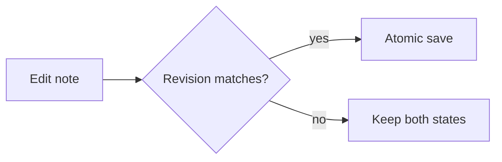

# ยินดีต้อนรับสู่ myVault

Vault ตัวอย่างนี้ใช้ตรวจว่า editor, reader, search, links และ graph ทำงานร่วมกันได้โดยไม่ต้องใช้ข้อมูลจริงค่ะ

## Demo checklist

- [x] เปิด Markdown ภาษาไทย
- [ ] แก้ข้อความแล้วรอ autosave 750 ms
- [ ] กด `Cmd/Ctrl + S` เพื่อบันทึกทันที
- [ ] สลับ Edit และ Read
- [ ] เปิด [[Projects/myVault Demo]] และดู backlinks
- [ ] ค้นหาคำว่า `local-first`

## ตารางสถานะ

| ความสามารถ | สถานะ | หมายเหตุ |
| --- | --- | --- |
| Local Vault | พร้อม | ไฟล์ปกติบนเครื่อง |
| Reader | พร้อมทดสอบ | HTML ต้องผ่าน sanitizer |
| Drive Sync | ภายหลัง | ไม่บล็อก Local Demo |

```ts
type SaveState = "clean" | "saving" | "conflict";
const autosaveDelayMs = 750;
```



ดูแนวคิดต่อที่ [[Knowledge/Local-first Safety]] และตัวอย่างภาษาไทยที่ [[Notes/ภาษาไทยและ Unicode]] ค่ะ

